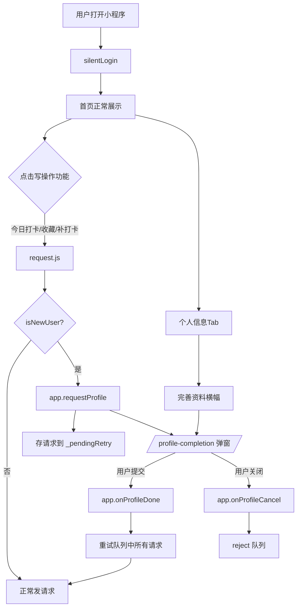
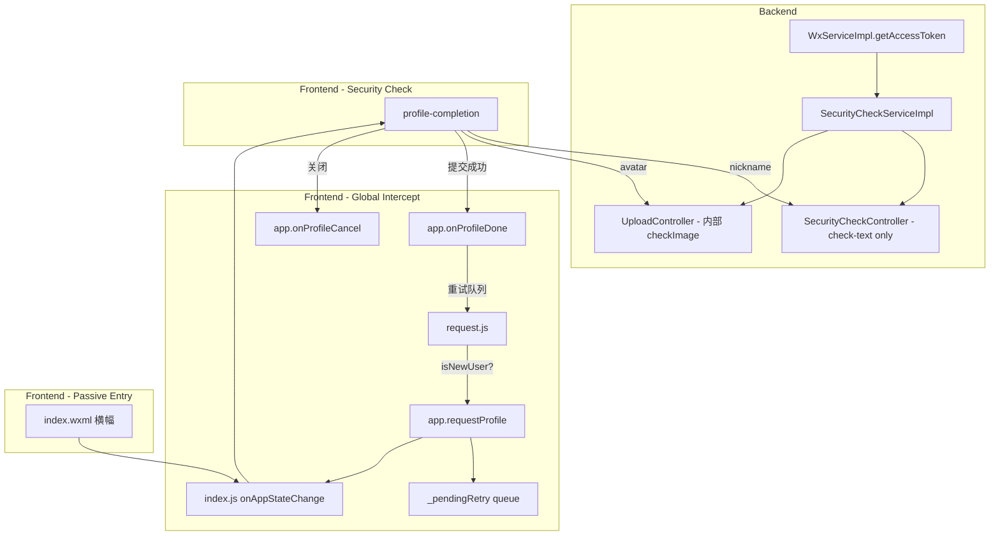

# 小程序审核整改实施计划 v4

## 概述

本计划针对微信小程序审核的两项失败原因制定整改方案：
- **问题1**：头像/昵称功能未接入微信内容安全API
- **问题2**：首页未浏览体验即弹窗要求授权（完善个人信息）

### v4 更新

- **头像检测**：改为**后端合并方案**——`/upload/avatar` 内部先调安全检测再存储，避免头像文件上传两次
- **昵称检测**：保持前端主导——`profile-completion` 提交前调 `/security/check-text`
- **问题2**：纯前端全局拦截（`request.js` 判断 `isNewUser`），零后端改动

---

## 问题1：接入内容安全API

### 1.1 总体策略

| 检测对象 | 策略 | 原因 |
|---------|------|------|
| 头像图片 | **后端合并**：`UploadController.uploadAvatar()` 内部先检测再存储 | 避免同一文件上传两次，1次 `wx.uploadFile` 搞定 |
| 昵称文本 | **前端主导**：提交前调 `POST /api/security/check-text` | 文本只有几十字节，单独调接口开销极小，即时反馈 |

### 1.2 后端改动

| 操作 | 文件 | 说明 |
|------|------|------|
| **修改** | `java-fit-server/src/main/java/com/fit/service/impl/WxServiceImpl.java` | 新增 `getAccessToken()`（内存缓存，提前5分钟刷新） |
| **新增** | `java-fit-server/src/main/java/com/fit/service/SecurityCheckService.java` | 接口：`checkText(String content)` / `checkImage(MultipartFile file)` |
| **新增** | `java-fit-server/src/main/java/com/fit/service/impl/SecurityCheckServiceImpl.java` | 实现：调用微信 `msgSecCheck` / `imgSecCheck` |
| **新增** | `java-fit-server/src/main/java/com/fit/controller/SecurityCheckController.java` | `POST /api/security/check-text`（供前端检测昵称） |
| **修改** | `java-fit-server/src/main/java/com/fit/controller/UploadController.java` | `uploadAvatar()` 方法中，文件类型校验之后、保存之前，注入 `securityCheckService.checkImage(file)` |

**`UploadController.uploadAvatar()` 改动（伪代码）**：

```java
@PostMapping("/avatar")
public Result<Map<String, String>> uploadAvatar(@RequestParam("file") MultipartFile file) {
    StpUtil.checkLogin();

    if (file.isEmpty()) return Result.error("文件不能为空");
    // 校验文件类型（原有）
    String contentType = file.getContentType();
    if (contentType == null || !contentType.startsWith("image/"))
        return Result.error("只允许上传图片文件");

    // 新增：内容安全检测
    boolean safe = securityCheckService.checkImage(file);
    if (!safe)
        return Result.error(400, "内容含违规信息，请修改后重试");

    // 原有保存逻辑不变 ...
    String url = avatarUrlPrefix + "/" + filename;
    return Result.success(Map.of("url", url));
}
```

> **注意**：Spring 的 `MultipartFile.getInputStream()` 在 `transferTo()` 之前可以被多次读取吗？不行。微信 `imgSecCheck` 需要读取文件字节。解决方案：先 `file.getBytes()` 保存到 `byte[]`，传给检测接口，检测通过后再写入磁盘。

**`SecurityCheckServiceImpl.checkImage()` 实现要点**：

```java
public boolean checkImage(byte[] imageBytes) {
    String token = wxService.getAccessToken();
    String url = "https://api.weixin.qq.com/wxa/img_sec_check?access_token=" + token;

    // 构建 multipart/form-data，字段名 media
    // 使用 RestTemplate + MultiValueMap / 或直接 HttpURLConnection
    // ...

    JsonNode resp = objectMapper.readTree(response);
    int errcode = resp.get("errcode").asInt();
    // errcode=87014 表示违规
    return errcode == 0;
}
```

**`SecurityCheckController`（仅暴露文本检测给前端）**：

```
POST /api/security/check-text
Body: { "content": "昵称" }
→ { code:200, data: { pass: true } }
  { code:200, data: { pass: false }, message: "内容含违规信息，请修改后重试" }
```

### 1.3 小程序端改动

| 操作 | 文件 | 说明 |
|------|------|------|
| **修改** | `mp-fit-ts/components/profile-completion/profile-completion.js` | `submitProfile()` 先调 `api.post('/security/check-text', { content: nickname })` 检测昵称 |
| **修改** | `mp-fit-ts/pages/profile/profile.js` | `saveProfile()` 同样加入文本安全检测 |
| *不改* | 头像上传流程 | 后端 `UploadController` 内部已做检测，前端无需改动 |

**`profile-completion.js` 检测流程**：

```
submitProfile() {
  1. 校验隐私 + 昵称非空（已有）
  2. wx.showLoading('安全检测中...')
  3. api.post('/security/check-text', { content: nickname.trim() })
     → pass=false → hideLoading + toast('内容含违规信息，请修改后重试')
     → pass=true → 继续
  4. 有本地头像 → wx.uploadFile 调 /upload/avatar（后端内部检测）
     → 后端返回 400 → toast('内容含违规信息，请修改后重试')
  5. 调 /user/update-profile 保存资料
}
```

**`profile.js` 同样处理**。

---

## 问题2：纯前端全局拦截机制

### 2.1 核心思想

**在 `request.js` 中对所有写操作统一判断 `isNewUser`**，拦截后走 `app.js` 全局弹窗管理器，完善资料后自动重试。各页面零改动。

```
用户点「今日打卡/收藏菜品/补打卡」
  → request.js POST 请求
  → 检测 isNewUser == true
  → 不发起 HTTP 请求，直接调 app.requestProfile(options)
  → app 存储请求到 _pendingRetry 队列
  → 通知 index 页面弹出 profile-completion
  → 用户填写提交 → app.onProfileDone() → 遍历 _pendingRetry 逐一重试
  → 用户关闭弹窗 → app.onProfileCancel() → reject 队列
```

### 2.2 覆盖范围（自动生效）

| 功能 | API | 写操作 | 拦截？ |
|------|-----|--------|--------|
| 今日打卡 | POST `/api/gym-workout/...` | ✅ | ✅ |
| 菜品收藏 | POST `/api/favorite-dish/...` | ✅ | ✅ |
| 补打卡 | POST `/api/gym-workout/...` | ✅ | ✅ |
| 查看榜单 | GET `/api/training-stats/...` | ❌ | ❌ 允许浏览 |
| 查看菜单 | GET `/api/canteen-menu/...` | ❌ | ❌ 允许浏览 |

### 2.3 交互流程



### 2.4 修改点详情

#### ① `app.js` — 删除强制弹窗 + 新增全局管理器

**删除**：`silentLogin` 成功回调中的 `wx.setStorageSync('showProfileModal', true)` 三行。

**新增**：

```javascript
globalData: {
  showProfileModal: false,
},

_pendingRetry: [],

requestProfile: function (originalOptions) {
  var that = this
  return new Promise(function (resolve, reject) {
    that._pendingRetry.push({ options: originalOptions, resolve: resolve, reject: reject })
    that.globalData.showProfileModal = true
    that._notifyPages()
  })
},

onProfileDone: function () {
  this.globalData.showProfileModal = false
  this._notifyPages()
  var pending = this._pendingRetry.splice(0)
  var request = require('./utils/request.js')
  pending.forEach(function (item) {
    request.request(item.options, true).then(item.resolve).catch(item.reject)
  })
},

onProfileCancel: function () {
  this.globalData.showProfileModal = false
  this._notifyPages()
  var pending = this._pendingRetry.splice(0)
  pending.forEach(function (item) { item.reject(new Error('用户取消')) })
},

_notifyPages: function () {
  var pages = getCurrentPages()
  for (var i = 0; i < pages.length; i++) {
    var page = pages[i]
    if (typeof page.onAppStateChange === 'function') {
      page.onAppStateChange(this.globalData)
    }
  }
},
```

#### ② `request.js` — 全局拦截（5行改动）

在 `request()` 函数开头，`new Promise` 之前增加：

```javascript
function request(options, _retried) {
  if (!_retried) {
    var isWrite = options.method === 'POST' || options.method === 'PUT' || options.method === 'DELETE'
    if (isWrite && wx.getStorageSync('isNewUser')) {
      var app = getApp()
      if (app && app.requestProfile) {
        return app.requestProfile(options)
      }
    }
  }
  // ... 原有 new Promise + wx.request 逻辑不变 ...
}
```

#### ③ `profile-completion.js` — 对接全局管理器

- `onClose()` 末尾增加 `getApp().onProfileCancel()`
- `submitProfile()` 成功回调中（`doUpdate` 成功后），`that.triggerEvent('success')` **之前**增加 `getApp().onProfileDone()`

#### ④ `index.js` — 适配全局状态

- `onLoad` / `onLoginReady`：删除 `_checkProfileModal()` 调用
- 删除 `_checkProfileModal` 方法
- 删除 `navigateToCheckin` 等入口的 `isNewUser` 判断（request.js 统一拦截）
- 新增方法：

```javascript
onAppStateChange: function (globalData) {
  this.setData({ showProfileModal: globalData.showProfileModal })
},

showProfileBanner: function () {
  this.setData({ showProfileModal: true })
},
```

#### ⑤ `index.wxml` — 完善资料引导横幅

在个人信息 Tab（`activeTab === 'tech'`）的 `user-info-card` 上方：

```xml
<view class="profile-banner" wx:if="{{ currentUser && currentUser.status === 0 }}" bindtap="showProfileBanner">
  <view class="profile-banner-left">
    <text class="profile-banner-icon">📝</text>
    <view class="profile-banner-body">
      <text class="profile-banner-title">完善个人信息</text>
      <text class="profile-banner-desc">设置头像和昵称，享受完整功能</text>
    </view>
  </view>
  <view class="profile-banner-arrow">›</view>
</view>
```

#### ⑥ `index.wxss` — 横幅样式

```css
.profile-banner {
  display: flex; align-items: center; justify-content: space-between;
  background: linear-gradient(135deg, #fff7ed, #fff);
  border: 2rpx solid #fed7aa; border-radius: 16rpx;
  padding: 22rpx 24rpx; margin-bottom: 20rpx;
}
.profile-banner:active { background: linear-gradient(135deg, #ffedd5, #fff7ed); }
.profile-banner-left { display: flex; align-items: center; flex: 1; overflow: hidden; }
.profile-banner-icon { font-size: 44rpx; flex-shrink: 0; margin-right: 18rpx; }
.profile-banner-body { display: flex; flex-direction: column; overflow: hidden; }
.profile-banner-title { font-size: 28rpx; font-weight: 600; color: #e6a23c; }
.profile-banner-desc { font-size: 22rpx; color: #909399; margin-top: 4rpx; }
.profile-banner-arrow { font-size: 36rpx; font-weight: 300; color: #e6a23c; flex-shrink: 0; margin-left: 12rpx; }
```

---

## 执行顺序

```
Phase 1（后端 — 问题1）:
  1. WxServiceImpl 新增 getAccessToken() + access_token 缓存
  2. 新建 SecurityCheckService + SecurityCheckServiceImpl
  3. 新建 SecurityCheckController（仅 check-text）
  4. 修改 UploadController.uploadAvatar() 注入 checkImage

Phase 2（小程序 — 问题1）:
  5. profile-completion.js submitProfile() 加入 check-text
  6. profile.js saveProfile() 加入 check-text

Phase 3（小程序 — 问题2，纯前端全局拦截）:
  7. app.js 新增 requestProfile/onProfileDone/onProfileCancel/_notifyPages，
     删除 silentLogin 中的 showProfileModal
  8. request.js 新增写操作 isNewUser 拦截
  9. profile-completion.js 对接 onProfileDone/onProfileCancel
  10. index.js 删除自动弹窗 + 新增 onAppStateChange/showProfileBanner
  11. index.wxml 新增完善资料横幅
  12. index.wxss 新增横幅样式
```

---

## Mermaid 总览


