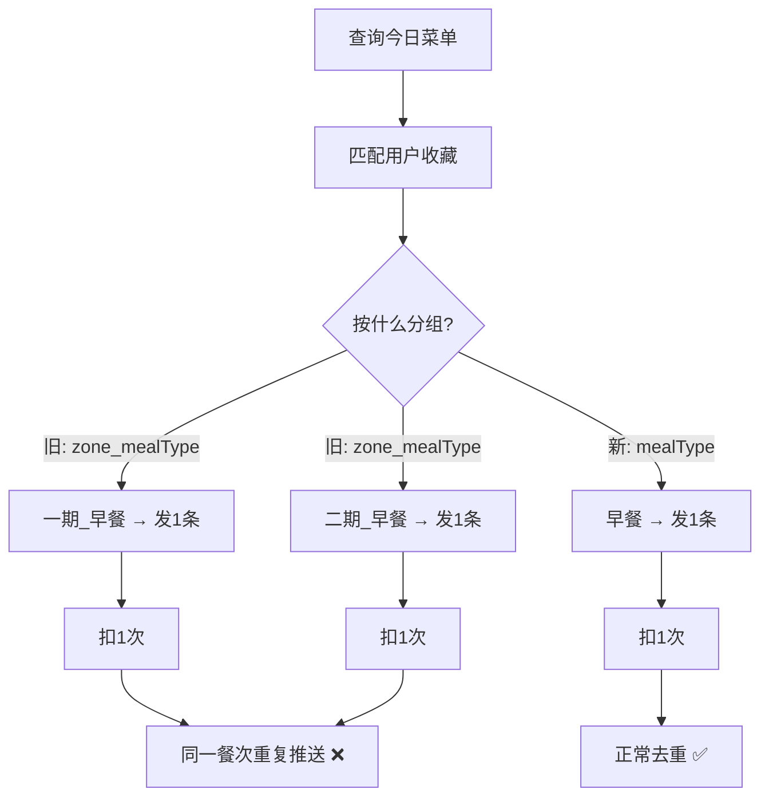

# 菜品收藏推送去重修复方案

> 问题：同一用户收藏的多个菜品在「一期」和「二期」同时出现时，会收到 2 条内容完全相同的模板消息。
> 修复目标：同一餐次只发一条消息，菜品跨食堂区域去重合并。

---

## 根因分析

`DishReminderJob.execute()` 第 126-134 行的分组逻辑：

```java
// 当前：按 canteenZone + "_" + mealType 分组
String key = record.getCanteenZone() + "_" + record.getMealType();
groupMap.computeIfAbsent(key, k -> new LinkedHashSet<>()).add(dishName);
```

当两个收藏菜品（如「红烧肉」和「酸辣土豆丝」）同时出现在「一期-早餐」和「二期-早餐」时：

| 分组键 | 菜品集合 |
|--------|----------|
| `一期_早餐` | {红烧肉, 酸辣土豆丝} |
| `二期_早餐` | {红烧肉, 酸辣土豆丝} |

两组各自触发一条微信模板消息，但模板消息中不含食堂区域字段（thing2 固定为"您收藏的菜品今日供应"），所以用户收到两条完全相同的消息。

---

## 修复方案（方案 A：按餐次合并）

**核心变更**：分组键从 `canteenZone + "_" + mealType` 改为仅 `mealType`，菜品名跨区域自动去重。

### 修改前 vs 修改后

| 维度 | 修改前 | 修改后 |
|------|--------|--------|
| 分组键 | `一期_早餐` → 1条 / `二期_早餐` → 1条 | `早餐` → 1条 |
| 菜品集合 | 每组各自维护 Set | 全局按 mealType 去重合并 Set |
| 发送次数 | 每个 zone+meal 组合各发 1 条 | 每个 mealType 仅发 1 条 |
| 扣减次数 | 每条消息 -1 | 每条消息 -1（消息数减少，总扣减也减少） |

### 影响分析



---

## 实施步骤

### Step 1: 修改 `DishReminderJob.java`

**文件**：`java-fit-server/src/main/java/com/fit/job/DishReminderJob.java`

**变更点**（第 126-170 行区域）：

1. **分组键简化**：`canteenZone + "_" + mealType` → 仅 `mealType`
2. **菜品自动去重**：因为同一个 `LinkedHashSet` 是按 mealType 聚合的，同名菜品天然去重
3. **canteenZone 合并**：记录推送历史时，canteenZone 字段从单一区域改为多区域合并（如 `"一期、二期"` 或 `"一期"`（单区域时不变））

具体 diff：

```java
// ===== 分组逻辑 (约第126-134行) =====
// 旧代码：
Map<String, Set<String>> groupMap = new LinkedHashMap<>();
for (String dishName : matchedDishNames) {
    List<CanteenMenuRecord> records = dishMenuMap.get(dishName);
    if (records == null) continue;
    for (CanteenMenuRecord record : records) {
        String key = record.getCanteenZone() + "_" + record.getMealType();
        groupMap.computeIfAbsent(key, k -> new LinkedHashSet<>()).add(dishName);
    }
}

// 新代码：
// 按 mealType 分组（跨食堂区域合并），同时记录涉及的 canteenZone
Map<String, Set<String>> dishGroupMap = new LinkedHashMap<>();    // mealType → dishNames
Map<String, Set<String>> zoneGroupMap = new LinkedHashMap<>();     // mealType → canteenZones
for (String dishName : matchedDishNames) {
    List<CanteenMenuRecord> records = dishMenuMap.get(dishName);
    if (records == null) continue;
    for (CanteenMenuRecord record : records) {
        String mealType = record.getMealType();
        dishGroupMap.computeIfAbsent(mealType, k -> new LinkedHashSet<>()).add(dishName);
        zoneGroupMap.computeIfAbsent(mealType, k -> new LinkedHashSet<>()).add(record.getCanteenZone());
    }
}
```

```java
// ===== 发送循环 (约第137-190行) =====
// 旧代码：
for (Map.Entry<String, Set<String>> groupEntry : groupMap.entrySet()) {
    String key = groupEntry.getKey();
    String[] parts = key.split("_", 2);
    String canteenZone = parts[0];
    String mealType = parts.length > 1 ? parts[1] : "";
    // ...

// 新代码：
for (Map.Entry<String, Set<String>> groupEntry : dishGroupMap.entrySet()) {
    String mealType = groupEntry.getKey();
    Set<String> canteenZones = zoneGroupMap.get(mealType);
    String canteenZone = canteenZones != null && !canteenZones.isEmpty()
            ? String.join("、", canteenZones)
            : "";
    // ...
```

### Step 2: 同步修改 `DebugPushController.java`

**文件**：`java-fit-server/src/main/java/com/fit/controller/DebugPushController.java`

同样的分组逻辑变更（第 149-155 行区域），保持与定时任务完全一致。

### Step 3: 边界情况验证

| 场景 | 预期行为 |
|------|----------|
| 菜品同时出现在一期和二期 | dishName 去重，canteenZone 记录为 "一期、二期"，只发 1 条 |
| 菜品仅在一期出现 | 与旧行为一致，canteenZone 记录为 "一期"，发 1 条 |
| 同一菜品在早餐和午餐都出现 | 分属不同 mealType，各发 1 条（符合预期，不同餐次） |
| thing3 超过 20 字符 | 截断逻辑不变，在顿号处分隔加"等" |
| 早餐 2 个收藏菜品匹配 | 1 条消息，扣 1 次（原先按区域拆分会扣 2 次，修正后更合理） |
| 早餐 2 个 + 午餐 1 个匹配 | 2 条消息（早餐 1 + 午餐 1），扣 2 次 |

### Step 4: 扣减次数策略确认

修改前：每条消息扣 1 次（同一餐次多区域则多扣）
修改后：每条消息扣 1 次（同一餐次合并后只扣 1 次）

**这是符合业务预期的**——同一餐次本就应该只通知一次，不应多扣。

---

## 涉及文件清单

| 文件 | 改动类型 |
|------|----------|
| `java-fit-server/src/main/java/com/fit/job/DishReminderJob.java` | 修改：分组逻辑 + canteenZone 合并 |
| `java-fit-server/src/main/java/com/fit/controller/DebugPushController.java` | 修改：同步分组逻辑 |
| 无新增文件 | — |
| 无数据库变更 | — |

---

## 不改动的部分

- `PushMessageHistory` 实体和表结构保持不变（`canteenZone` 字段 VARCHAR(20) 足够容纳 "一期、二期"）
- `WxSubscribeMessageService` 无需改动
- 小程序前端无需改动
- 配额扣减逻辑无需改动（每条消息固定 -1）
